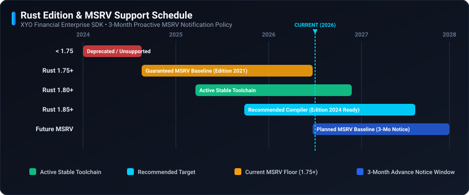

# 🛡️ Security Policy

## 📋 Supported Versions

Only the current major release line of the XYO Rust SDK receives active security updates and patches.

| Version | Supported | End of Security Support |
| ------- | --------- | ----------------------- |
| 2.x     | :white_check_mark: | Active                  |
| < 2.0.0 | :x:                | End of Life (EOL)       |

## ⚙️ Runtime Lifecycle & MSRV Support Policy

### Policy Guarantee
XYO Financial adheres to a deterministic **Minimum Supported Rust Version (MSRV)** policy designed for mission-critical enterprise environments.

- **Guaranteed MSRV Baseline:** We guarantee support for our stated MSRV baseline (**Rust 1.75+** on **Rust Edition 2021**).
- **3-Month Proactive Window:** We will never raise the MSRV without at least **3 months advance notice** in release notes and documentation before cutting a release requiring a newer compiler baseline.

| Compiler Track | Edition | Status | SDK Support Level |
| :--- | :--- | :--- | :--- |
| **Rust 1.85+** | 2021 / 2024 | :white_check_mark: Active Stable | **Current Recommended Target** |
| **Rust 1.80 – 1.84** | 2021 | :white_check_mark: Active Stable | Fully Supported |
| **Rust 1.75 – 1.79** | 2021 | :lock: Baseline Floor | **Guaranteed Minimum MSRV Floor** |
| **Rust < 1.75** | 2018 / 2021 | :x: Deprecated | **Unsupported / Compiler Incompatible** |

## 🚨 Reporting a Vulnerability

If you discover a potential security vulnerability in this SDK, please do not report it publicly through a GitHub issue. Instead, report it privately:

- **Email:** security@syniol.com
- **Response Time:** We will acknowledge receipt of your vulnerability report within 48 hours and provide a detailed response on next steps within 5 business days.
