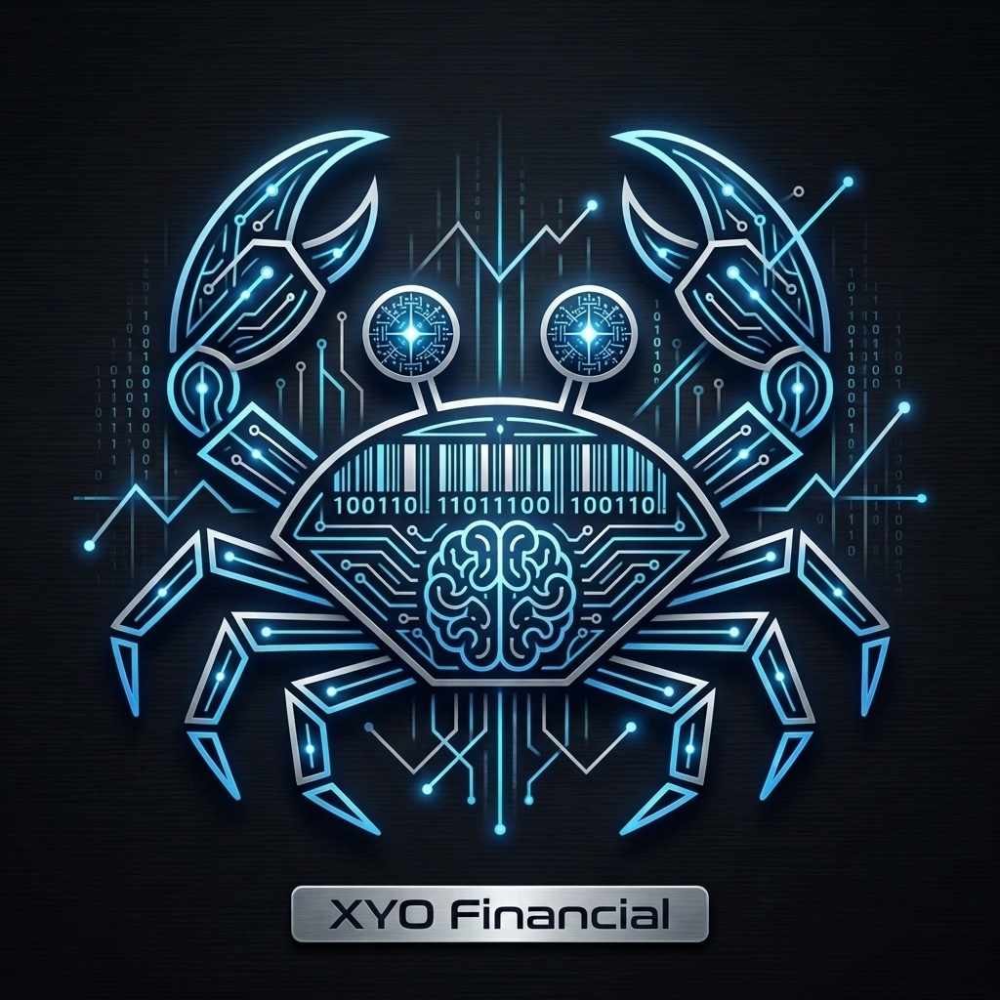
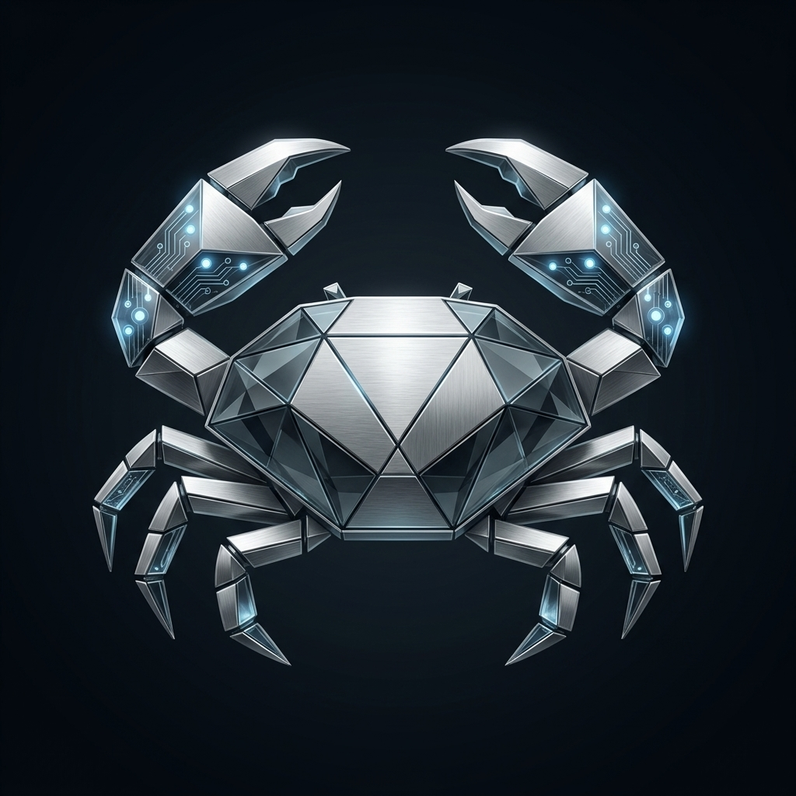

# Rust SDK Mascot Concepts

Here are three elegant, modern variations of the Rust mascot tailored for the high-end financial and AI sector:

````carousel

> **Sleek Neon HFT Crab**: A minimalist logo crafted from glowing neon blue and silver lines. It perfectly captures the essence of modern artificial intelligence and high-frequency trading (HFT) on a premium dark background.

<!-- slide -->

> **Platinum Geometric Crab**: A highly polished, abstract geometric crab made of brushed platinum and glass. The subtle glowing digital nodes on its claws represent secure, corporate AI processing. This is a very clean, premium enterprise identity.

<!-- slide -->

> **Luxury Navy FinTech Crab**: A sophisticated network-graph crab using a high-end palette of deep navy and subtle gold. This aesthetic screams advanced financial technology, elegance, and exclusivity.
````
